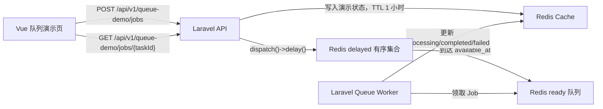

# Redis 队列技术文档

## 1. 目标与边界

本项目使用 Laravel Queue + Redis 执行异步任务，通过独立 Docker Compose Worker 处理队列。

当前队列负责：

- 承载 Laravel 异步 Job；
- 支持真实的延迟执行；
- 记录失败任务；
- 监控默认队列积压；
- 提供一个登录后可操作的 Redis 延迟队列演示。

队列不用于必须在当前 HTTP 响应中立即返回结果的操作。延迟执行必须使用 Laravel 的 `delay()`，不得用 `sleep()` 占用 Worker 模拟。

## 2. 架构



Docker Compose 服务职责：

| 服务 | 职责 |
| --- | --- |
| `redis` | 存储 Session、Cache、待处理/延迟/保留队列，开启 AOF |
| `queue` | 运行 `php artisan queue:work` |
| `scheduler` | 运行 Laravel Scheduler，每分钟检查队列积压 |
| `app` | 提供 API、派发 Job 和查询状态 |

## 3. 核心配置

Laravel 环境变量位于 `backend/.env`：

```dotenv
QUEUE_CONNECTION=redis
REDIS_QUEUE=default
REDIS_QUEUE_RETRY_AFTER=90
REDIS_QUEUE_BLOCK_FOR=5
REDIS_QUEUE_AFTER_COMMIT=true
QUEUE_MONITOR_MAX_JOBS=100
```

| 配置 | 当前值 | 含义 |
| --- | ---: | --- |
| `QUEUE_CONNECTION` | `redis` | 使用 Redis 队列驱动 |
| `REDIS_QUEUE` | `default` | 默认队列名 |
| `REDIS_QUEUE_RETRY_AFTER` | `90` | Job 领取后 90 秒未确认完成时可重新入队 |
| `REDIS_QUEUE_BLOCK_FOR` | `5` | Worker 最长阻塞等待 5 秒，减少空轮询 |
| `REDIS_QUEUE_AFTER_COMMIT` | `true` | 数据库事务提交后才派发 Job |
| `QUEUE_MONITOR_MAX_JOBS` | `100` | 队列积压警告阈值 |

`queue` 容器当前执行参数：

```text
php artisan queue:work
  --sleep=3
  --tries=3
  --backoff=5
  --timeout=80
  --max-time=3600
```

关键关系：

- `--timeout=80` 必须小于 `retry_after=90`，确保卡住的 Worker 先退出，再由 Redis 重新投递 Job；
- `stop_grace_period=100s` 大于 Worker 超时，便于容器优雅停止；
- `--max-time=3600` 每小时回收长驻 Worker，Docker 通过 `restart: unless-stopped` 自动拉起；
- `init: true` 帮助转发信号和回收子进程。

## 4. Redis 队列数据结构

Laravel Redis 驱动为每个队列维护三类逻辑数据（实际 Key 会带项目 Redis prefix）：

| 逻辑结构 | 用途 |
| --- | --- |
| `queues:default` | 已可执行、等待 Worker 领取的 Job |
| `queues:default:delayed` | 未到执行时间的延迟 Job，按时间戳排序 |
| `queues:default:reserved` | Worker 已领取但尚未删除/释放的 Job |

Worker 循环会将已到期的 delayed Job 迁移到 ready 队列，并将超过 `retry_after` 的 reserved Job 重新放回 ready 队列。

Redis 队列提供“至少一次”处理语义，不保证业务操作天然只执行一次。真实业务 Job 必须设计为幂等。

## 5. 延迟队列演示

### 5.1 行为契约

| 概念 | 定义 |
| --- | --- |
| `delay_seconds` | Job 在 Worker 可领取前的等待秒数，范围 1–10 |
| `available_at` | 预计可执行的 UTC ISO 8601 时间 |
| `queued` | Job 已派发，仍在 Redis delayed/ready 阶段，尚未开始业务处理 |
| `processing` | Worker 已领取 Job |
| `completed` | Worker 已完成 Job |
| `failed` | Job 在重试耗尽后失败 |

`available_at` 是预计时间，不是实时调度承诺。实际开始时间受 `block_for`、Worker 负载、队列顺序和系统调度影响。

页面在 `queued` 状态下会比较当前时间与 `available_at`：尚未到期显示“延迟等待”，到期但尚未领取时显示“等待 Worker”。

### 5.2 派发

```php
ProcessQueueDemo::dispatch($taskId)
    ->delay($delaySeconds);
```

`delay()` 只控制“什么时候允许 Worker 领取”，不代表 Job 本身的处理耗时。Job 的 `handle()` 不包含人工等待。

### 5.3 状态保存

演示状态保存在 Cache Store（当前为 Redis），Key 逻辑格式为：

```text
queue-demo:task:{uuid}
```

TTL 为 1 小时。每次状态更新会刷新 TTL。这个存储只用于演示，真实订单、支付、返利或审计任务的状态必须持久化到数据库。

状态转换使用每任务独立的 Redis Cache 锁保护读改写。`completed` 和 `failed` 是不可回退的终态；重复投递不会把终态重新写成 `processing`，同一状态的重试也不会刷新开始时间。

## 6. API

### 6.1 提交延迟任务

```http
POST /api/v1/queue-demo/jobs
Content-Type: application/json
```

```json
{
  "message": "这是一条 Redis 延迟任务",
  "delay_seconds": 5
}
```

响应状态码为 `202 Accepted`。`message` 最长 100 字符，`delay_seconds` 必须为 1–10 的整数。接口限制为每用户每分钟 10 次。

### 6.2 查询任务

```http
GET /api/v1/queue-demo/jobs/{taskId}
```

- 未登录：`401`；
- 任务不存在或 TTL 已过期：`404`；
- 任务属于其他用户：`403`；
- 查询成功：`200`。

## 7. Job 失败、重试与幂等

`ProcessQueueDemo` 当前配置：

```php
public int $tries = 3;
public int $timeout = 30;
public array $backoff = [2, 5];
```

- 首次失败后等待 2 秒重试；
- 第二次失败后等待 5 秒重试；
- 最多尝试 3 次；
- 最终失败时 `failed()` 将演示状态更新为 `failed`，Laravel 同时写入 `failed_jobs`；查询 API 仅返回固定的友好文案，不暴露原始异常详情；
- 详细异常由 Laravel Worker 和 `failed_jobs` 保留，排查时只允许受信任的运维人员访问。

真实业务 Job 应使用唯一业务键、数据库唯一索引、状态条件更新或 Laravel 唯一 Job 等机制保证幂等，不得假设 Worker 绝不会重复执行。

## 8. 监控与运维

### 8.1 常用命令

```bash
# 容器状态
docker compose ps

# Worker 日志
docker compose logs -f queue

# 队列的 pending / delayed / reserved 数量
docker compose exec app php artisan queue:monitor redis:default --max=100

# 失败任务
docker compose exec app php artisan queue:failed

# 重试指定失败任务
docker compose exec app php artisan queue:retry <id>

# 让 Worker 在完成当前 Job 后优雅重启
docker compose exec app php artisan queue:restart

# 手动恢复被停止的 Worker 容器
docker compose up -d queue
```

### 8.2 积压监控

Scheduler 每分钟运行：

```text
php artisan queue:monitor redis:default --max=100
```

当总任务数达到阈值时，`AppServiceProvider` 监听 `QueueBusy` 事件并写入结构化 warning 日志，包含 connection、queue 和 jobs。

当前未接入邮件、Slack 或 PagerDuty 等外部告警；生产环境应将 warning 日志接入集中化日志和告警系统。

## 9. 部署

队列 Worker 是长驻进程，启动后不会自动重新加载已变更的 PHP 代码。发布后必须执行：

```bash
docker compose exec app php artisan queue:restart
```

Docker 将在 Worker 优雅退出后自动拉起容器。发布脚本不应使用立即强制终止，以免中断正在执行的 Job。

## 10. 测试策略

队列功能至少覆盖：

- 未登录用户无法提交或查询；
- 参数边界校验；
- Job 已派发到正确 connection/queue；
- Job 携带正确的 delay；
- 延迟等待期仍为 `queued`，且 `started_at` 为空；
- Worker 执行后状态变为 `completed`；
- 最终失败时状态变为 `failed`；
- 重复执行和失败回调不能覆盖 `completed` / `failed` 终态；
- 其他用户不能读取任务；
- 真实 Redis + Worker 环境中，delayed 数量在等待期增加，到期后清零。

自动化测试使用 `Queue::fake()` 断言派发语义，并直接调用 Job 验证状态转换。端到端验证必须另外使用真实 Redis Worker。

## 11. 故障排查

### Worker 容器退出

```bash
docker compose ps --all queue
docker compose logs --tail=200 queue
docker inspect --format '{{json .State}}' laravelvue-queue-1
```

重点检查退出码、OOMKilled、Redis 连接、PHP 超时和最后一个 Job。

### Job 一直处于 delayed

- 检查 `queue` 容器是否运行；
- 检查 Redis 时间和应用时间；
- 检查 Worker 是否监听相同 connection/queue；
- 用 `queue:monitor` 区分 pending、delayed 和 reserved。

### Scheduler 报 `queues=redis` 连接不存在

`queue:monitor` 的 `queues` 是位置参数。使用 `Schedule::command()` 的参数数组时，必须把 `redis:default` 作为数字索引值传入；写成 `'queues' => 'redis:default'` 会被拼成 `queues=redis:default`，Laravel 将其误识别为连接名。

修正后可执行以下命令验证：

```bash
docker compose exec app php artisan schedule:list
docker compose exec app php artisan schedule:run
```

### Job 重复执行

- 检查 Job 运行时间是否超过 `retry_after`；
- 确认 Worker `timeout` 小于 `retry_after`；
- 检查 Worker 或容器是否被强制终止；
- 为真实业务补充幂等保护。

### 页面查不到演示任务

演示状态 TTL 只有 1 小时，过期后 API 返回 `404`。浏览器刷新后也不会自动恢复上一个任务 ID。

## 12. 已知限制与演进

- 当前只有一个 `default` 队列和一个 Worker 进程；
- 积压告警只写日志；
- 演示状态不持久化；
- 未使用 Laravel Horizon；
- Redis AOF 降低重启丢失风险，但不代替备份和高可用方案。

当队列成为核心业务基础设施时，应评估：

- 按优先级和资源消耗拆分多队列；
- 使用 Horizon 管理 Worker、吞吐和失败监控；
- 接入外部告警；
- 为核心 Job 建立数据库状态机和幂等键；
- 对 Redis 进行权限、备份、高可用和容量规划。
